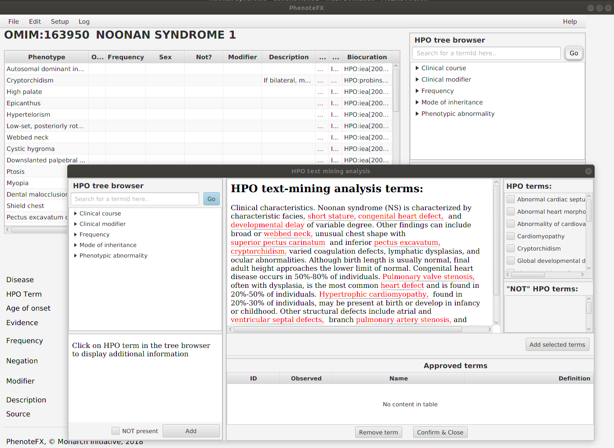

# PhenoteFX: A tool for annotating the Human Phenotype Ontology

PhenoteFX is a Desktop Java App  for working with  Human Phenotype Ontology (HPO) Annotation data. It
is designed to help curators revise or create phenotype annotation records for Human Phenotype Ontology (HPO)
rare disease data. PhenoteFX is currently at version 0.8.5 and can be downloaded at its 
[GitHub repository](https://github.com/monarch-initiative/phenotefx){:target="_blank"}.

<figure markdown>
{ width="600" }
<figcaption>PhenoteFX - overview</figcaption>
</figure>

### Feedback

The best place to leave feedback, ask questions, and report bugs is the 
[PhenoteFX Issue Tracker](https://github.com/monarch-initiative/PhenoteFX/issues){:target="_blank"}.

