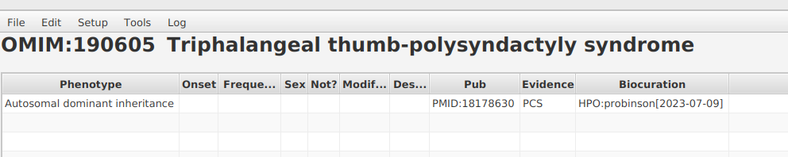
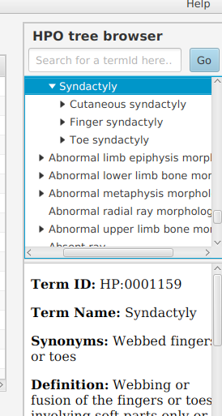

.. _add_annot:

==================
Adding annotations
==================

The PhenoteFX app requires each annotation to have a citation from PubMed. Therefore, the first thing to do is to 
grab the pubmed id from the article you are curating.

For this example, we will use data from 
`Klopocki E, et al. (2008_) A microduplication of the long range SHH limb regulator (ZRS) 
is associated with triphalangeal thumb-polysyndactyly syndrome. J Med Genet. 45:370-5 <https://pubmed.ncbi.nlm.nih.gov/18178630/>`_.

The corresponding ID that PhenoteFX expects is ``PMID:18178630`` (no space in between PMID: and the number, but PhenoteFX will 
automatically remove spaces when you paste the id into the dialog).

.. figure:: img/PhenotePMID.png
    :scale: 50 %
    :align: center
    :alt: PhenoteFX - specifying the PubMed id 

Paste the PMID into the ``source `` field, as shown above.

Now we can add the first annotation. In this case, we will add the mode of inheritance as 
`Autosomal dominant inheritance HP:0000006 <https://hpo.jax.org/app/browse/term/HP:0000006>`_. Note that if
we type some letters into the ``HPO Term`` field, PhenoteFX will autocomplete the term if it can. 

.. figure:: img/PhenoteAutocomplete.png
    :scale: 50 %
    :align: center
    :alt: PhenoteFX - Autocomplete 

If you hit the enter button, the term will be chosen. Then click on the ``Add annotation`` button. 

This adds the annotation to the curation file. The PMID is now stored as the default value and does not need to be changed unless
you want to switch to a new citation.

We can see the clinical features to annotate in Table 1 of PMID:18178630. For instance, 11 of 12 affected 
individuals had 
`Triphalangeal thumb HP:0001199 <https://hpo.jax.org/app/browse/term/HP:0001199>`_.
We can enter the frequency data as follows (and click the ``Add annotation`` button to enter the annotation).
Note that in this case, the context of the article implies that if a ``+`` is not shown inthe table, the individual 
did not have the feature in question. This may not always be the case and the curator should read the article to be 
able to accurately curate the data.

.. figure:: img/triphalangeal-annot.png
    :scale: 80 %
    :align: center
    :alt: PhenoteFX - Annotating triphalangeal thumb

We continue entering features in this way. The table states that five individuals had ``syndactly``. However, the text 
states that individuals in the family had ``cutaneous/osseous syndactyly of fingers III–V or IV/V``. We do not have further
details, and we typically curate with as much detail as possible given the data in the original publication. To search
for a more detailed syndactyly term, we can use the HPO ontology browser on the top right of PhenoteFX.

.. figure:: img/PhenoteTree.png
    :scale: 40 %
    :align: center
    :alt: PhenoteFX - Ontology Browser

From this, we choose the term 
`Finger syndactyly HP:0006101 <https://hpo.jax.org/app/browse/term/HP:0006101>`_.

.. figure:: img/PhenoteAnnot2.png
    :scale: 80 %
    :align: center
    :alt: PhenoteFX - annotations

The above figure shows the appearance of PhenoteFX after we have entered several annotations. When we are finished,
we can use the Save or Save and Close items in the File menu to save our work (see :ref:`filemenu`).