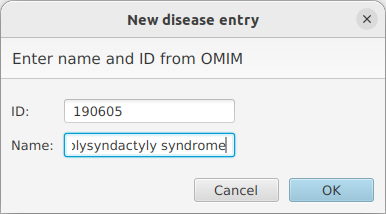

.. _createnew:

==================
Create a new entry
==================

To create a new entry, use the New item from the File menu (:ref:`filemenu`). This opens a new dialog, where
you can enter the OMIM id (just the 6-digit number)
and the disease name (it is easiest to use copy paste for both operations). When you are done, click "OK".

