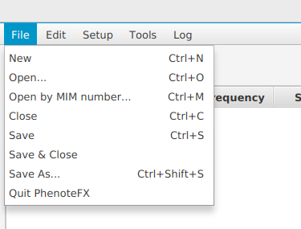

# PhenoteFX File Menu

Use the file menu to start a new curation file, open an existing one, or save your work.

<figure markdown>
{ width="400" }
<figcaption>PhenoteFX file menu</figcaption>
</figure>

- New Start a new curation file. 
- Open Open an existing curation file using a standard file-system browser
- Open by MIM number If you have stored your files as OMIM:******.tab, where ****** stands for the OMIM identifier, then this command will open a file if you enter the OMIM number.
   The command only works for files stored in the PhenoteFX default directory (see :ref:`tutorial_setup`). 
- Close Close the current file. You will be asked if you want to save work if applicable.
- Save & Close Save the current file and then close it.
- Save As Save the current file using a standard system browser and optionally change the file name.
- Quit PhenoteFX Exit the app.