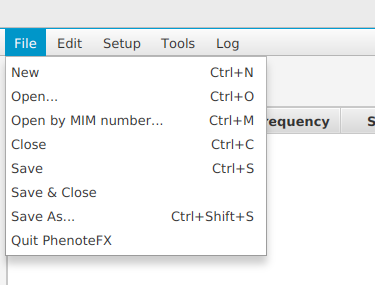

.. _filemenu:

===================
PhenoteFX File Menu
===================

Use the file menu to start a new curation file, open an existing one, or save your work.

    PhenoteFX setup menu. Use it to perform the following commands.

1. **New** Start a new curation file.
2. **Open** Open an existing curation file using a standard file-system browser
3. **Open by MIM number** If you have stored your files as OMIM:******.tab, where ****** stands for the OMIM identifier, then this command will open a file if you enter the OMIM number.
   The command only works for files stored in the PhenoteFX default directory (see :ref:`tutorial_setup`).
4. **Close** Close the current file. You will be asked if you want to save work if applicable.
5. **Save & Close** Save the current file and then close it.
6. **Save As** Save the current file using a standard system browser and optionally change the file name.
7. **Quit PhenoteFX** Exit the app.