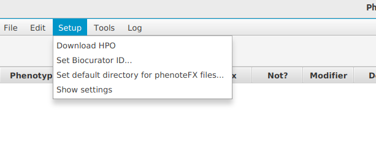

# Setting up PhenoteFX

When you use PhenoteFX for the first time, you need to download some files and tell PhenoteFX
where you would like to store the annotation files.

<figure markdown>
{ width="400" }
<figcaption>PhenoteFX setup menu. Use it to perform the following commands.</figcaption>
</figure>

### Download HPO
This will download the latest release of hp.obo from the HPO GitHub page.

### Set Biocurator ID
Enter whatever you would like be be nano-attributed by, e.g., MGM:rrabbit.

### Set default directory for phenoteFX files
This will be the directory where you store the HPO annotation filess. Each annotated disease will 
have its own file that will be named OMIM-123456.tab (for the corresponding OMIM id).

### Show settings
This item opens a window to show the current settings and allows the settings entered in the previous three steps to be checked.

