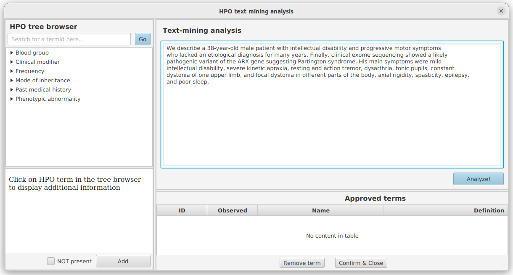
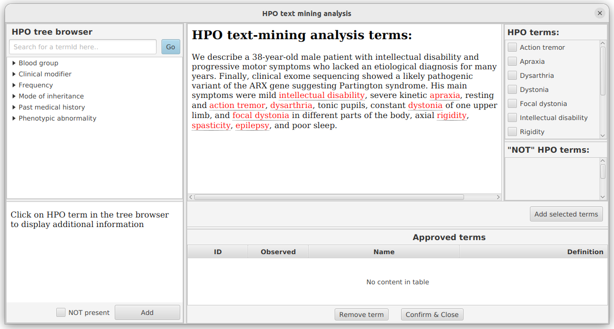
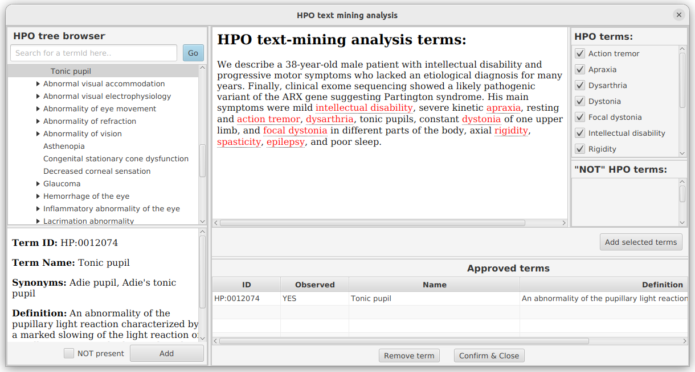
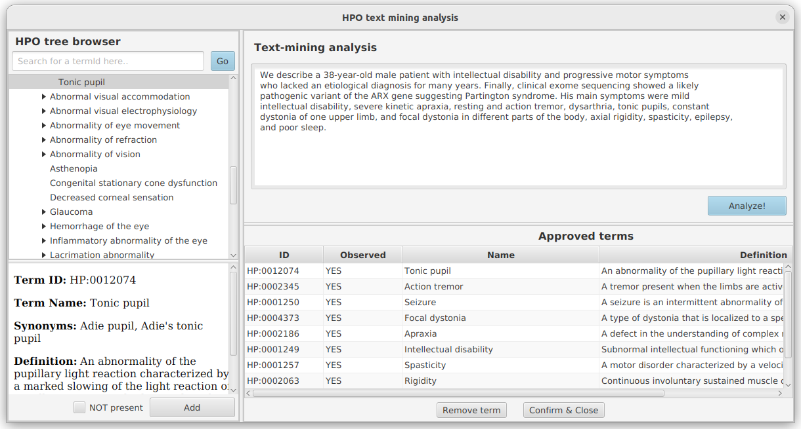
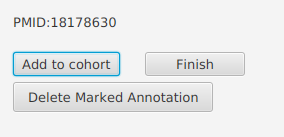
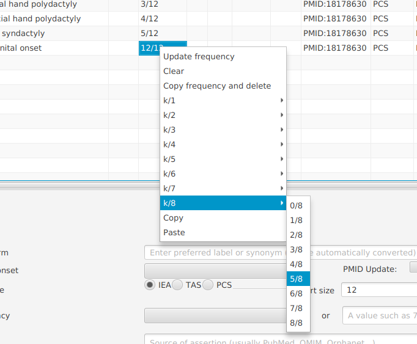

# Text mining

PhenoteFX can also help to annotate patients one at a time starting from clinical vignettes (short descriptions).
In the following example, we use the description of individual 1 from 

For this example, we will use data from 
[Wieczorek D, et al. (2010) A specific mutation in the distant sonic hedgehog (SHH) cis-regulator (ZRS) causes 
Werner mesomelic syndrome (WMS) while complete ZRS duplications underlie Haas type polysyndactyly and preaxial polydactyly 
(PPD) with or without triphalangeal thumb. Hum Mutat 31:81-9](https://pubmed.ncbi.nlm.nih.gov/19847792/){:target="_blank"}

To perform text mining, click the ``Add to cohort`` button.

<figure markdown>
{ width="600" }
<figcaption>PhenoteFX - text mining</figcaption>
</figure>

 Now, paste  the relevant text into the dialog that appears, click the ``Analyze`` button.

<figure markdown>
{ width="600" }
<figcaption>PhenoteFX - text mining</figcaption>
</figure>

Confirm the relevant findings by adding a check mark (or drag and drop to the exluded findings list below). Here, we
have also used the browser to add the term `Tonic pupil HP:0012074 <https://hpo.jax.org/app/browse/term/HP:0012074>`_, 
which the text mining algorithm did not pick up.

<figure markdown>
{ width="600" }
<figcaption>PhenoteFX - text mining</figcaption>
</figure>

Finally, click on ``Add selected terms`` to get the final list of terms for the current individual.

<figure markdown>
{ width="600" }
<figcaption>PhenoteFX - text mining</figcaption>
</figure>

When you are satisfied with the terms, click on the ``Confirm & close`` button.

### One or multiple individuals

Text mining can be used for one patient or for a cohort of patients. If you use it for a cohort of 
patients, then click on the ``Add to cohort`` button for each patient until you are done.

### Finalizing text mining

To transfer the text mined results to the main PhenoteFX application, click on the ``Finish`` button.

<figure markdown>
{ width="600" }
<figcaption>PhenoteFX - text mining</figcaption>
</figure>

### Adjusting results

To add more information or edit a line, you can right click on many of the fields (Onset, Frequency, Sex, Pub, Evidence).
For instance, here we have right-clicked on a frequency and could change the frequency.

<figure markdown>
{ width="600" }
<figcaption>PhenoteFX - text mining</figcaption>
</figure>