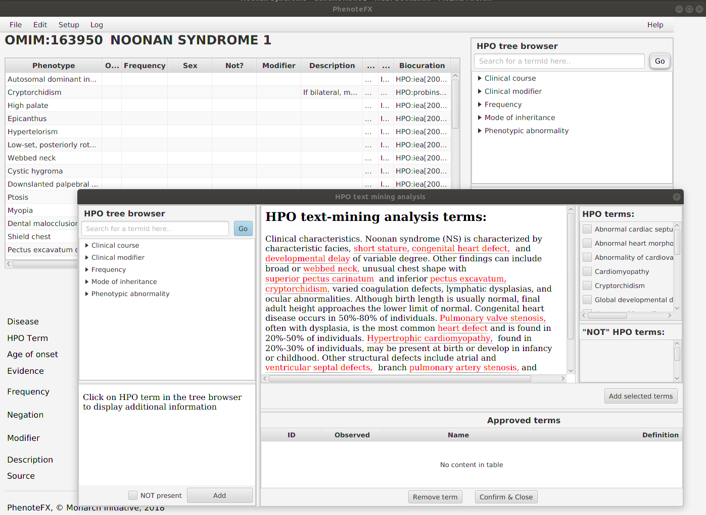

=============================================================
PhenoteFX: A tool for annotating the Human Phenotype Ontology
=============================================================

PhenoteFX is a Desktop Java App  for working with  Human Phenotype Ontology (HPO) Annotation data. It
is designed to help curators revise or create phenotype annotation records for Human Phenotype Ontology (HPO)
rare disease data. PhenoteFX is currently at version 0.4.5.

--------
Feedback
--------

The best place to leave feedback, ask questions, and report bugs is the `PhenoteFX Issue Tracker <https://github.com/monarch-initiative/PhenoteFX/issues>`_.

.. toctree::
    :caption: Installation & Tutorial
    :name: tutorial
    :maxdepth: 1
    :hidden:

    install
    tutorial_setup
    tutorial_local_hpo
    tutorial_working

.. toctree::
    :caption: Project Info
    :name: project-info
    :maxdepth: 1
    :hidden:

    contributing
    authors
    history
    license
  #  release_howto
