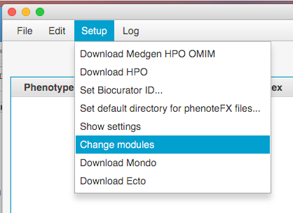
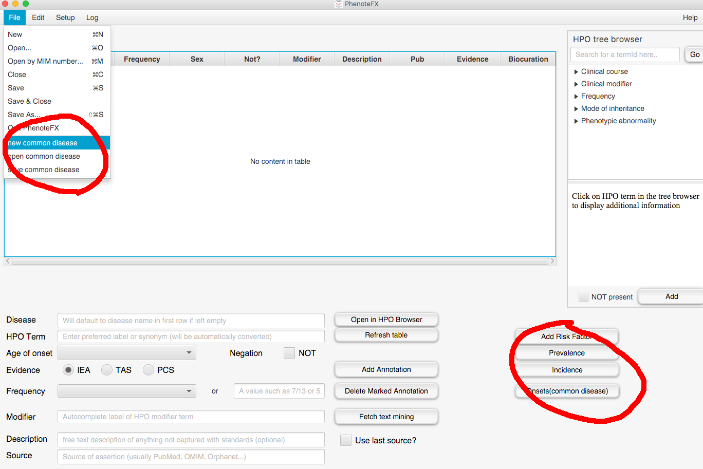

.. _tutorial_common_disease:

========================================
Common Disease Annotation with PhenoteFX
========================================

PhenoteFX now supports common disease annotation for the model defined in this repository: `commonDiseaseAnnotation`_.

.. _commonDiseaseAnnotation: https://github.com/monarch-initiative/commonDiseaseAnnotation

Briefly, this model considers the following aspects of a common disease:

- Prevalence
- Incidence
- Onset
- Phenotype
- Risk Factor

For each category, PhenoteFX allows biocurators to add multiple pieces of information from literature.

To compile PhenoteFX
~~~~~~~~~~~~~~~~~~~~
The `commonDiseaseAnnotation`_ repo is not yet public. So you need to request access and install it on you local computer if you want to compile PhenoteFX from source code. The other option is to use the pre-compiled version.

.. _commonDiseaseAnnotation: https://github.com/monarch-initiative/commonDiseaseAnnotation

To start common disease annotation
~~~~~~~~~~~~~~~~~~~~~~~~~~~~~~~~~~
After you launch PhenoteFX, switch to common disease module from **Setup**/**Change modules**. It will ask your user name and password. Request a password from `Aaron Zhang <aaron.zhang@jax.org>`_.

Once validation is passed, you should be able to see additional buttons specific to common diseases appear on the bottom right. A few menuitems for common diseases will also appear under **File**.

Now we are ready to start the annotation process.

1. Specify the disease.
   To create a new disease annotation file, click **File**/**new common disease**.

   .. figure:: img/newcommondisease.png
    :align: center
    :scale: 90%

   Type in the disease name using the Monarch Disease Ontology (`MONDO <https://github.com/monarch-initiative/mondo>`_) and the disease ID will automatically fill in.

    .. figure:: img/newcommondiseasewindow.png
        :align: center
        :scale: 90%

   To add or update annotations to an existing disease model, use **File**/**open common disease**.

2. Add phenotype annotations.
   Phenotype annotation is identical to rare disease annotation. Refer to tutorial_working_ for details.

3. Add prevalence annotations.
   Click the **Prevalence** button to add the prevalence of the disease under annotation. You will see a popup window.

    .. figure:: img/prevalencepopup.png
        :align: center
        :scale: 100 %

   Click the **unisex** button to annotate the proportion of the population that have the disease. If the prevalence is sex-specific, select the **sexSpecific** button and add sex-specific annotation by clicking **male** and **female** buttons. Click **evidence** to add PMID, for example. Curation meta data (curator id and a timestamp) will be generated automatically. After you are done, click the **add** button to add the annotation to the table at the bottom.

   You can use right click to remove or edit the records in the table. Once you are done, you can use **confirm** to update the disease model. You can use **cancel** to drop the information in the table, and you disease model will not be impacted.

    .. figure:: img/prevalenceedit.png
        :align: center
        :scale: 100 %

4. Add incidence annotations.
   Click the **Incidence** button to annotate the incidences of the disease. You will see the following popup.

    .. figure:: img/incidencepopup.png
        :align: center
        :scale: 100 %

   Click **value**, **evidence** to add information, and click **add** to add the annotations to the table below. Then use right click on the table to delete or edit existing records. Finally, use **confirm** to update the disease model or **cancel** to drop current changes.

    .. figure:: img/incidenceedit.png
        :align: center
        :scale: 100 %

5. Add onset annotations.
   Click the **Onset(common disease)** button to annotate when the disease appear. Note that this is different to the onsets of phenotypes. You will see the following popup window.

    .. figure:: img/onsetpopup.png
        :align: center
        :scale: 100 %

   You can add an onset stage (e.g. infantile) by typing in the "label" textfield. Or add the exact age by unchecking **onset stage** and clicking **estimated age**. Add evidence by clicking **evidence** button. Then click **add** to add the information to the table.

   You can use right click to delete or edit the records in the table. Once you are done, use **confirm** to update the disease model, or **cancel** to drop current changes.

    .. figure:: img/onsetedit.png
        :align: center
        :scale: 100 %

6. Add risk factor annotations.
   Click **Add Risk Factor** button under the HPO hierarchy window to add risk factors of the current diease. You will see the following popup window:

    .. figure:: img/riskfactorpopup.png
        :align: center
        :scale: 80 %

   Use the **category** dropdown button to select the types of risk factors. For example, age is a risk factor for common cold. We can choose *AGE* and then type in "infant stage" in the right text field. After that, click the **add** button to add the risk factor to the table.

   Next, we need to add the effect size of the risk factor "infant stage". The *records* column indicates how many effect sizes we have added to the risk factor (Different papers may report different numbers). Right click on the row, and click **edit**. You will see a new popup window:

    .. figure:: img/effectsizepopup.png
        :align: center
        :scale: 100 %

   Use **category** to specify the types of measurement (see the table below). Then click on **change effect size** to update the effect size.

        +----------+-------------------+
        | abbrev.  | full              |
        +==========+===================+
        | AR       | absolute risk     |
        +----------+-------------------+
        | LR       | likelihood ratio  |
        +----------+-------------------+
        | OR       | odds ratio        |
        +----------+-------------------+
        | RR       | relative risk     |
        +----------+-------------------+

   The dropdown menu below **category** is intended to record the time course of the effect size. By default, the effect size is considered a constant, meaning that it will not changed with time. If it changes over time, click on "ASCEND", "DESCEND" or "BELL" and use the **change time course** button to adjust how it changes.

   Note that the plot indicates the trend of the effect size. The x axis indicates the lapse of time from the observation of the risk factor. The y axis indicates the fraction of annotated effect size. A y value of 1 indicates the max effect size and a y value of 0.5 indicates 50% of the annotated effect size.

    .. figure:: img/timecourse.png
        :align: center
        :scale: 80 %

   There are two numbers that control the trendline, both of which can be adjusted by the slide bars. The *center* bar controls when the effect size increases or decreases to 50%. The *steep* bar controls how fast the trend changes.

   Next, use the **evidence** button to add the PMID, and then **add** to the table.

   Use right click on the table to delete or update records. And then use **confirm** or **cancel** to commit or cancel the changes.
