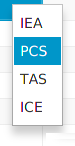

.. _tutorial_working:

======================
Working with PhenoteFX
======================

<Todo--write more documentation>

Updating the evidence code for an existing entry
~~~~~~~~~~~~~~~~~~~~~~~~~~~~~~~~~~~~~~~~~~~~~~~~
Occasionally, we would like to update an existing annotation. For instance, we would like to add a PubMed citation
for an entry that was created by text mining. In this case, we will update the evidence code from ``IEA`` (inferred
from electronic annotation) to ``PCS`` (published clinical study). To do this, right click on the table cell with
the evidence code and choose the updated evidence code. You will see a popup menu with the four available evidence
codes. Click the desired code to update the code in the table.

Updating the citation for an existing entry
~~~~~~~~~~~~~~~~~~~~~~~~~~~~~~~~~~~~~~~~~~~
The citation (reference) for an HPO annotation is kept in the **Pub** column. We will sometimes want to update this
field. For instance, if an entry was created by text mining, we may have a citation such as "OMIM:154700", but say
we have found a PubMed entry that provides more information. Then, we would like to update the entry to PMID:123, where
123 stands for the PubMed id. For instance, the if the HPO entry for Marfan syndrome shows an annotation
for ``Autosomal dominant inheritance`` that is referenced to ``OMIM:154700``, this indicates that the assertion
was derived from the Online Mendelian Inheritance in Man (OMIM) page
for `Marfan syndrome <https://omim.org/entry/154700>`_. The article at PubMed
id `PMID:17502658 <https://www.ncbi.nlm.nih.gov/pubmed/17502658>`_ provides more detail about this assertion, and
so we would replace ``OMIM:154700`` with ``PMID:17502658``.

To do so, first right click on the publication entry for the annotation of interest. You will see a field to click on.

.. figure:: img/updatepubClick.png
    :scale: 100 %
    :alt: PhenoteFX - update publication 1

If you click on the field, a new dialog window will appear with the current publication entry. Replace or edit this
entry and click on ``OK`` in order to change the publication. If you click on ``Cancel``, the window will close and the entry will
not be changed.

.. figure:: img/updatepubDialog.png
    :scale: 100 %
    :alt: PhenoteFX - update publication 2

Updating the Description and Frequency fields
~~~~~~~~~~~~~~~~~~~~~~~~~~~~~~~~~~~~~~~~~~~~~
The description and the frequency fields can be updated in the same way as the publication field. Please note that
for frequency, one of three valid formats must be used.

1. An HPO Term ID from the Frequency subontology, e.g., ``HP:0040280``

2. An expression such as 4/6 (meaning that 4 out of 6 patients with the disease in question were found to have the phenotypic feature denoted by the HPO term).

3. An expression such as 45% (meaning that 45% of patients with the disease in question were found to have the phenotypic feature denoted by the HPO term).

PhenoteFX currently does not check that the format of the frequency term is correct, but this feature will be added in the future.